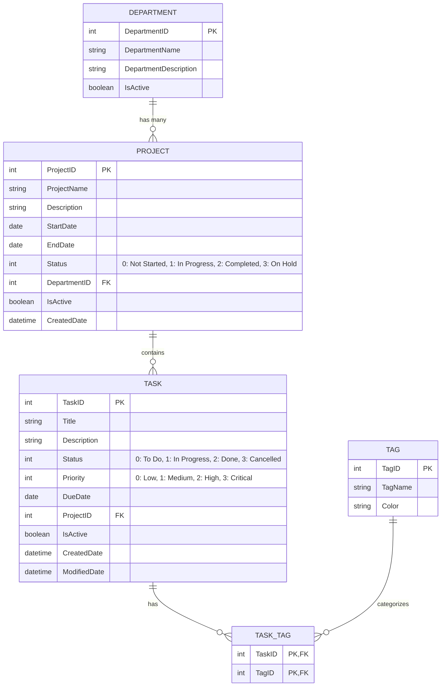

# TaskTrack Frontend - PRN232 Assignment 1

Frontend giao diện người dùng cho hệ thống **TaskTrack**, xây dựng với **Next.js 16 (App Router)**, **TypeScript**, **Tailwind CSS**, và **Sonner Toast**.

---

## 📁 Cấu trúc thư mục (Project Structure)

```
QE190072_SE19B.NET_Ass1_FE/
├── src/
│   ├── app/
│   │   ├── page.tsx                     # Dashboard: Thống kê tổng quan, biểu đồ Donut 4 trạng thái
│   │   ├── departments/manage/page.tsx  # Quản lý Phòng ban (Chế độ Table & Grid view)
│   │   ├── projects/manage/page.tsx     # Quản lý Dự án (Chế độ Table & Grid view)
│   │   ├── projects/[id]/page.tsx       # Chi tiết Dự án & Task Board Kanban (To Do, In Progress, Done, Cancelled)
│   │   ├── tasks/manage/page.tsx        # Quản lý Công việc & phân nhóm hạn chót
│   │   ├── tasks/[id]/page.tsx          # Chi tiết Công việc
│   │   ├── tags/manage/page.tsx         # Quản lý Nhãn & màu sắc
│   │   ├── search/page.tsx              # Tìm kiếm & lọc nâng cao đa điều kiện
│   │   └── layout.tsx                   # Root layout tích hợp Toaster
│   ├── components/
│   │   ├── layout/                      # AppLayout (Header mobile, Navigation Drawer, Sidebar)
│   │   └── ui/                          # UI components (Button, Input, Dialog, Table, Badge, Card...)
│   └── lib/
│       ├── axios.ts                     # Axios client cấu hình base URL
│       └── api-error.ts                 # Trích xuất lỗi chi tiết từ backend (validation message)
├── .env.example                         # Mẫu biến môi trường
├── .env.local                           # Biến môi trường local
└── package.json
```

---

## ✨ Tính năng nổi bật (Key Features)

1. **Table View & Grid View chuẩn Rubric**:
   - Trang **Departments** và **Projects** mặc định hiển thị dạng **Table** đầy đủ thông tin (ID, Tên, Mô tả, Phòng ban, Tiến độ, Trạng thái, Thao tác).
   - Hỗ trợ nút chuyển đổi sang dạng **Grid Card** trực quan.
2. **Task Board Kanban đầy đủ 4 trạng thái**:
   - Hỗ trợ toàn bộ trạng thái: `To Do`, `In Progress`, `Done`, và `Cancelled`.
   - Hỗ trợ toàn bộ độ ưu tiên: `Low`, `Medium`, `High`, và `Critical`.
   - Cho phép tạo, sửa, xóa công việc nhanh chóng ngay trên board.
3. **Thống kê Dashboard chuẩn xác**:
   - Biểu đồ phân bổ trạng thái hình vành khăn (Donut Chart) tính toán chính xác cả công việc `Cancelled`.
   - Danh sách công việc cần chú ý chỉ hiển thị các công việc còn hạn/quá hạn đang hoạt động (loại trừ đã xong hoặc đã hủy).
4. **Toast Notifications mượt mà**:
   - Tích hợp thư viện `sonner` thông báo thành công / thất bại sau các thao tác **Create, Update, Delete** ở Departments, Projects, Tasks, Tags.
   - Bắt và hiển thị chính xác lỗi từ Backend (validation 400 hoặc lỗi ràng buộc khóa ngoại).
5. **Thiết kế Responsive Mobile**:
   - Tự động chuyển đổi Sidebar thành Navigation Drawer dạng trượt kèm nút Hamburger trên màn hình điện thoại / máy tính bảng.
   - Bảng dữ liệu tự động cho phép cuộn ngang (`overflow-x-auto`) không bị vỡ giao diện.

---

## ⚙️ Biến môi trường (Environment Variables)

Tạo file `.env.local` ở thư mục gốc:

```env
NEXT_PUBLIC_API_URL=http://localhost:5093/api
```

Khi deploy lên môi trường Production (như Vercel):
```env
NEXT_PUBLIC_API_URL=https://your-backend-api.onrender.com/api
```

---

## 🚀 Hướng dẫn cài đặt và chạy Local

1. **Clone repository:**
   ```bash
   git clone https://github.com/chithong17/QE190072_SE19B.NET_Ass1_FE.git
   cd QE190072_SE19B.NET_Ass1_FE
   ```

2. **Cài đặt các gói phụ thuộc:**
   ```bash
   npm install
   ```

3. **Chạy server phát triển (Development):**
   ```bash
   npm run dev
   ```
   Mở trình duyệt truy cập: [http://localhost:3000](http://localhost:3000)

4. **Kiểm tra build production:**
   ```bash
   npm run build
   npm run start
   ```

---

## 🌐 Triển khai (Deployment)

- **Nền tảng đề xuất:** [Vercel](https://vercel.com) (tối ưu hóa cho Next.js).
- **Cấu hình trên Vercel:**
  - **Framework Preset:** `Next.js`
  - **Environment Variables:**
    - `NEXT_PUBLIC_API_URL`: URL Backend API đã deploy (VD: `https://tasktrack-api.onrender.com/api`).

---

## 📊 Sơ đồ cơ sở dữ liệu (ERD - Entity Relationship Diagram)



---

## 🌟 Tính năng cộng điểm (Bonus Features)

- [x] **GitHub Actions CI/CD**: Tự động kiểm tra build Next.js trên mỗi push (`.github/workflows/ci.yml`).
- [x] **ERD Diagram**: Tài liệu sơ đồ thực thể liên kết trực quan trong `README.md`.
- [x] **Task Status Filter**: Lọc theo trạng thái trên danh sách công việc (`/tasks/manage`) và chi tiết dự án (`/projects/[id]`).
- [x] **3 Project Views**: Hỗ trợ đồng thời 3 chế độ xem linh hoạt: Kanban Board, Timeline trực quan, và List Table.
- [x] **Field-level Validation & Confirm Dialogs**: Hộp thoại xác nhận trước mọi thao tác xóa dữ liệu.

